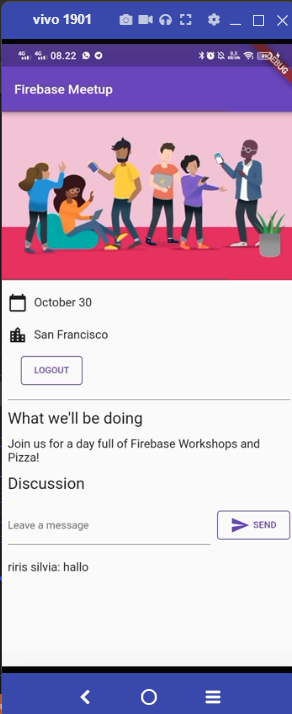

# flutter_firestore_firebase

A new Flutter project.

### Mendapatkan kode sampel
Kloning repositori GitHub 
```
git clone https://github.com/flutter/codelabs.git 
```

### Buat dan siapkan proyek Firebase
Aktifkan Cloud Firestore: Di bagian Build Firebase console, klik Cloud Firestore .
Klik Buat basis data .


### Konfigurasi Firebase
#### Konfigurasi dependensi
```
flutter pub add firebase_core 
flutter pub add firebase_auth
flutter pub add cloud_firestore
flutter pub add provider
```

#### Memasang flutterfire
```
dart pub global activate flutterfire_cli
```

#### Mengonfigurasi aplikasi Anda
```
flutterfire configure
```

### Tambahkan login pengguna (RSVP)
- Berikut adalah awal dari alur otentikasi, di mana pengguna dapat menekan tombol RSVP, untuk memulai formulir email.

- Setelah memasukkan email, sistem mengkonfirmasi jika pengguna sudah terdaftar, dalam hal ini pengguna dimintai kata sandi, atau jika pengguna tidak terdaftar, maka mereka pergi melalui formulir pendaftaran.


- ketika berhasil login


### Tulis pesan ke Cloud Firestore

- Untuk mengirim pesan pastikan sudah masuk ke akun 

- Coba untuk memasukkan pesan, disini saya mencoba memasukkan pesan "Hi!" 


- Pesan yang berhasil dikirimkan akan tersimpan pada cloyd firestore, seperti gambar berikut 


### Status RSVP Peserta

